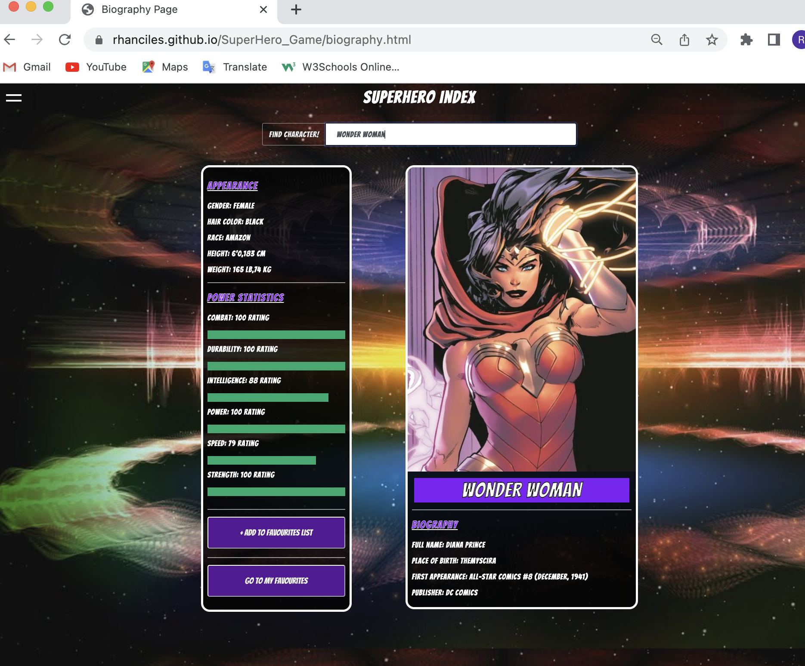

# Superhero Trump Card Game
_A card game that generates 2 Random Cards to play.

## Overview
A group of young developers decided to take on the task to design a game as part of their project. Putting their knowledge and expertise in Front-End Web Development to the test, they decided to create a variant of the Top Trumps Superhero Card game. Utilizing code from HTML, CSS, jQuery and JavaScript. 
The app design and code that powers it, needs to be functional and aesthetically pleasing. Once finished the game should be playable for anyone nad everyone! The game should be able to run in the browser and have a clean, polished, and responsive user interface.

## Description
The game requires 2 players and the computer just happens to be one of the pair. Here are the rules:  
    1.	Player(user) and computer have an equal number of cards at the start of the game.
    2.	The User will start the game by default by making their selection.
    3.	There are 6 stats with a corresponding value respectively: Combat, Durability, Intelligence, Power, Speed and Strength.
    4.	The User can view their card but cannot see the computers until they have chosen the stats to battle. 
    5.	The User should choose 1 out of 6 stats on the card, if the value of the stats is higher than the value of stats from the computer's card, the user will win         the round.
    6.	The same is true vice versa, The computer will win if it's stat is higher.
    7.	You lose a card if you lose a round and your opponent gains that card.
    8.	The game ends when one person runs out of cards, and the player with all the cards wins.
    
## Screenshots

   

## Website
https://rhanciles.github.io/SuperHero_Game

## Github
https://github.com/rhanciles/SuperHero_Game

## Meet the team: 
    •	Candice Wong – Bootstrap, Modals, CSS & HTML
    •	Saqib Rafiq - Bootstrap & modals, CSS & HTML
    •	Rod: Git Hub, JS/jQuery, UI and Project Management
    •	Ranjit: APIs & JS/jQuery, and Presentation
    •	Ryan: HTML, Client-side storage, User Interaction & Wireframe
    •	Sandra: User Story, README, UI, Bootstrap modals, CSS & HTML

## Feedback
We hope you've enjoyed our App. Please feel free to reach out or drop a comment here if you have any questions, queries or suggestions. Thanks.

